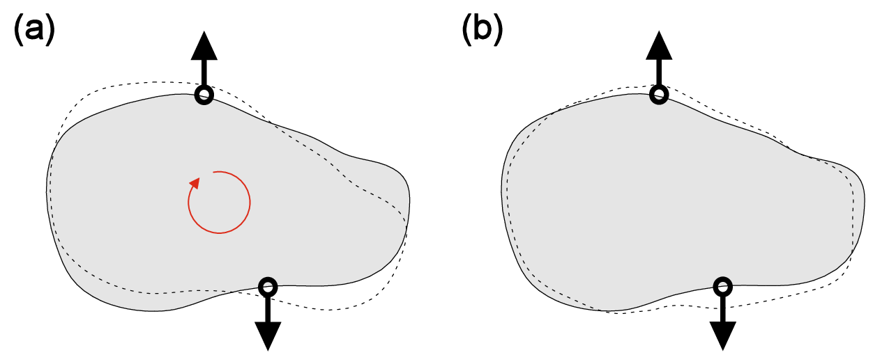
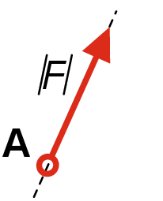
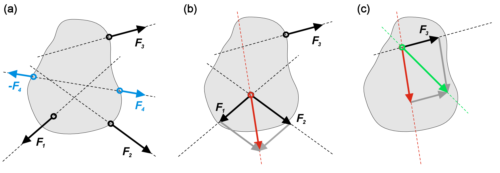
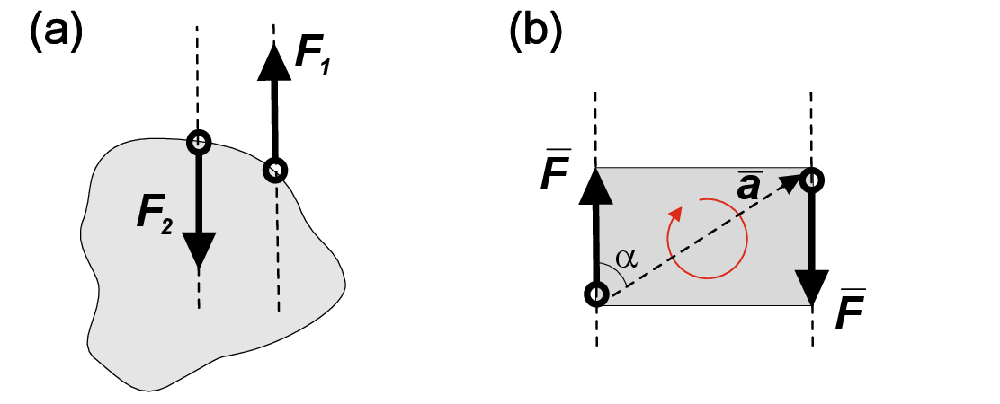
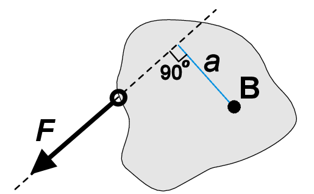

<h2 class='chapterHead'>Chapter 1 Force and moment equilibria</h2>
<h3 class='sectionHead'>1.1  Statics, rigid bodies and force systems</h3>
<!-- l. 5 -->
<a class='url' href='https://uni-freiburg.cloud.panopto.eu/Panopto/Pages/Embed.aspx?id=f4af2ded-cd2b-4e10-adf4-ac720118d222'>https://uni-freiburg.cloud.panopto.eu/Panopto/Pages/Embed.aspx?id=f4af2ded-cd2b-4e10-adf4-ac720118d222</a>

<!-- l. 7 -->
 Statics is the subdivision of mechanics concerned with the forces that
act on solid bodies at rest under equilibrium conditions. The solid
body can be thought of as a collection of matter within an identifiable
boundary, and it is important to distinguish notions of rigid and deformable
bodies.

<figure class='figure'>

<!-- l. 14 -->
  

<figcaption class='caption'>Figure 1.1:: The rigid body (a) can translate and rotate, while the deformable
body (b) can also change its shape. </figcaption><!-- tex4ht:label?: x1-2001r1.1 -->

</figure>

<!-- l. 20 -->

<!-- tex4ht:inline -->

 <table class='tabular' id='TBL-1'><colgroup id='TBL-1-1g'><col id='TBL-1-1' /></colgroup><tr style='vertical-align:baseline;' id='TBL-1-1-'><td class='td11' id='TBL-1-1-1' style='white-space:nowrap; text-align:left;'>Rigid body (Chapters 1-3) </td>
</tr><tr class='hline'><td>
</td></tr><tr style='vertical-align:baseline;' id='TBL-1-2-'><td class='td11' id='TBL-1-2-1' style='white-space:nowrap; text-align:left;'>Do not change its shape under internal or external forces </td>
</tr><tr style='vertical-align:baseline;' id='TBL-1-3-'><td class='td11' id='TBL-1-3-1' style='white-space:nowrap; text-align:left;'>Forces and moments can be plotted as a function of a position</td>
</tr><tr style='vertical-align:baseline;' id='TBL-1-4-'><td class='td11' id='TBL-1-4-1' style='white-space:nowrap; text-align:left;'>”Nothing” happens within material </td>
</tr></table>

<!-- l. 30 -->

<!-- tex4ht:inline -->

 <table class='tabular' id='TBL-2'><colgroup id='TBL-2-1g'><col id='TBL-2-1' /></colgroup><tr style='vertical-align:baseline;' id='TBL-2-1-'><td class='td11' id='TBL-2-1-1' style='white-space:nowrap; text-align:left;'>Deformable body (Chapters 4-12) </td>
</tr><tr class='hline'><td>
</td></tr><tr style='vertical-align:baseline;' id='TBL-2-2-'><td class='td11' id='TBL-2-2-1' style='white-space:nowrap; text-align:left;'>Can change its shape under internal or external forces </td>
</tr><tr style='vertical-align:baseline;' id='TBL-2-3-'><td class='td11' id='TBL-2-3-1' style='white-space:nowrap; text-align:left;'>Inherent material properties must be accounted to find deformation</td>
</tr></table>

  

<figcaption class='caption'>Figure 1.2::
The force \(F\) is fully
determined by
magnitude \(|F|\), line of
action (dashed
line), direction and
contact point A. </figcaption><!-- tex4ht:label?: x1-2003r1.1 -->

<!-- l. 50 -->
 Mechanics heavily relies on the notion of force. We all intuitively understand
this concept, and in physics, force usually represents internal or external action on
the body. From a practical point of view, any force can be represented as a vector
\(\v{F}\), and it is fully determined by its magnitude \(|F|\), line of action, direction and contact
point (Fig. <a href='#x1-2003r2'>1.2<!-- tex4ht:ref: fig:forcevector --></a>).

<!-- l. 52 -->
 Fig. <a href='#x1-2015r3'>1.3<!-- tex4ht:ref: fig:resultant --></a>a shows a rigid body subjected to multiple forces. In engineering
mechanics, every combination of forces acting on the rigid body is called a force
system. Graphical representation of force vectors enables the replacement of
multiple forces acting on the body by a single equivalent force called the resultant
of the system. Besides one important exception that will be discussed later,
every force system can be reduced to resultant via a simple step-by-step
procedure:

<ol class='enumerate1'>
<li class='enumerate' id='x1-2006x1'>Pick two forces acting on the body;
</li>
<li class='enumerate' id='x1-2008x2'>Shift both forces along their corresponding acting line to the point of
intersection;

</li>
<li class='enumerate' id='x1-2010x3'>Replace these forces by their resultant (vector sum of the initial forces);
</li>
<li class='enumerate' id='x1-2012x4'>Start all-over, until only one force is left;
</li>
<li class='enumerate' id='x1-2014x5'>The remaining force is the resultant of the initial force system.</li></ol>
<figure class='figure'>

<!-- l. 69 -->
  

<figcaption class='caption'>Figure 1.3:: Reduction of the force system to the single resultant. </figcaption><!-- tex4ht:label?: x1-2015r1.1 -->

</figure>
<!-- l. 75 -->
 Fig. <a href='#x1-2015r3'>1.3<!-- tex4ht:ref: fig:resultant --></a> illustrates this procedure for arbitrarily selected force system. First,
blue forces \(F_4\) cancel each other since they share the line of action, have the same
magnitude and opposite directions (Fig. <a href='#x1-2015r3'>1.3<!-- tex4ht:ref: fig:resultant --></a>a). Then, by sliding the forces \(F_1\) and \(F_2\)
to the intersection point of their corresponding action lines, we can get the
resultant of \(F_1\) and \(F_2\) (red vector in Fig. <a href='#x1-2015r3'>1.3<!-- tex4ht:ref: fig:resultant --></a>b). Then, the same procedure for this new
resultant and initial force \(F_3\) gives us the resultant of the whole system (green vector
in Fig. <a href='#x1-2015r3'>1.3<!-- tex4ht:ref: fig:resultant --></a>c).

<h3 class='sectionHead'>1.2  Force couples and moments</h3>
<!-- l. 78 -->
<a class='url' href='https://uni-freiburg.cloud.panopto.eu/Panopto/Pages/Embed.aspx?id=01a89ffb-ca4e-434d-8368-ac72011bb5bb'>https://uni-freiburg.cloud.panopto.eu/Panopto/Pages/Embed.aspx?id=01a89ffb-ca4e-434d-8368-ac72011bb5bb</a>

<!-- l. 81 -->
 Two forces (Fig. <a href='#x1-3001r4'>1.4<!-- tex4ht:ref: fig:forcecouple --></a>a) cannot be reduced to a single resultant if they have

<ul class='itemize1'>
<li class='itemize'>Same magnitude
</li>
<li class='itemize'>Parallel lines of action
</li>
<li class='itemize'>Opposite directions</li></ul>
<figure class='figure'>

<!-- l. 94 -->
  

<figcaption class='caption'>Figure 1.4:: (a) Two forces forming force couple. (b) Moment of the force
couple. </figcaption><!-- tex4ht:label?: x1-3001r1.2 -->

</figure>
<!-- l. 100 -->
 Such a force system is called a force couple or pure moment. If a resultant
represents the translation movement of the rigid body, a pure moment
corresponds to rotation. The moment of force couple is defined by direction of
rotation, magnitude and distance between corresponding lines of action
(Fig. <a href='#x1-3001r4'>1.4<!-- tex4ht:ref: fig:forcecouple --></a>b). Note that force moment is not fixed at any certain contact point
and can be moved freely over the whole body as long as the direction
of rotation and magnitude of the moment are conserved. In a general
3D system, we can define the moment as cross product of two vectors
\begin{equation} \v{M}=\v{a}\times{\v{F_1}}, \end{equation}
where \(\v{a}\) is a vector connecting the contact points of two vectors in force couple, and
\(\v{F_1}\) is one of these vectors as shown in Fig. <a href='#x1-3001r4'>1.4<!-- tex4ht:ref: fig:forcecouple --></a>b. The vector representation of
moment enables us to define moment area \(|\v{M}|\) as \begin{equation} |\v{M}|=|\v{a}\times{\v{F_1}}|=|\v{a}||\v{F_1}|\sin{\alpha }, \end{equation}
where \(\alpha \) is the angle enclosed by \(\v{a}\) and \(\v{F_1}\). Note that by definition, the moment area is
always positive, however a specific sign can be assigned to the moment depending
on its direction.

  

<figcaption class='caption'>Figure 1.5:: Force \(F\)
exerts moment at a
point B. </figcaption><!-- tex4ht:label?: x1-3003r1.2 -->

<!-- l. 125 -->
 A single force will exert a moment at a certain point B outside from its line
of action (Fig. <a href='#x1-3003r5'>1.5<!-- tex4ht:ref: fig:singleforcemoment --></a>). This moment of single force is defined as a product of the
force magnitude \(|F|\) and the perpendicular distance \(a\) between point B and the line of
action (\(M=a|F|\)). Note that the contact point of \(F\) and action point B cannot coincide. The
moment of a single force is sometimes called a torque. It is important not
to mix up moments generated by force couple and by a single
force.

<!-- l. 128 -->

<!-- tex4ht:inline -->

 <table class='tabular' id='TBL-3'><colgroup id='TBL-3-1g'><col id='TBL-3-1' /></colgroup><tr style='vertical-align:baseline;' id='TBL-3-1-'><td class='td11' id='TBL-3-1-1' style='white-space:nowrap; text-align:left;'>The force couple </td>
</tr><tr class='hline'><td>
</td></tr><tr style='vertical-align:baseline;' id='TBL-3-2-'><td class='td11' id='TBL-3-2-1' style='white-space:nowrap; text-align:left;'>May induce a pure rotation of a body</td>
</tr><tr style='vertical-align:baseline;' id='TBL-3-3-'><td class='td11' id='TBL-3-3-1' style='white-space:nowrap; text-align:left;'>Does not have a reference point </td>
</tr></table>

<!-- l. 137 -->

<!-- tex4ht:inline -->

 <table class='tabular' id='TBL-4'><colgroup id='TBL-4-1g'><col id='TBL-4-1' /></colgroup><tr style='vertical-align:baseline;' id='TBL-4-1-'><td class='td11' id='TBL-4-1-1' style='white-space:nowrap; text-align:left;'>The single force </td>
</tr><tr class='hline'><td>
</td></tr><tr style='vertical-align:baseline;' id='TBL-4-2-'><td class='td11' id='TBL-4-2-1' style='white-space:nowrap; text-align:left;'>May induce a translation of the body </td>
</tr><tr style='vertical-align:baseline;' id='TBL-4-3-'><td class='td11' id='TBL-4-3-1' style='white-space:nowrap; text-align:left;'>Exert a moment in a reference point outside its line of action</td>
</tr></table>

<!-- l. 146 -->
 Now we understand how to work with forces and moments, and it is time to
define the last word in the definition given at the beginning of this chapter –
equilibrium. 

<!-- l. 148 -->
 A 2D force system is in equilibrium if the sum of all forces \(F_i\) and the sum of all
moments \(M_i\) equal zero. \begin{equation} \sum _{i}{F_i}=0 \quad \text{and}\quad \sum _{i}{M_i}=0 \end{equation}

<h2 class='likechapterHead'>Bibliography</h2>

