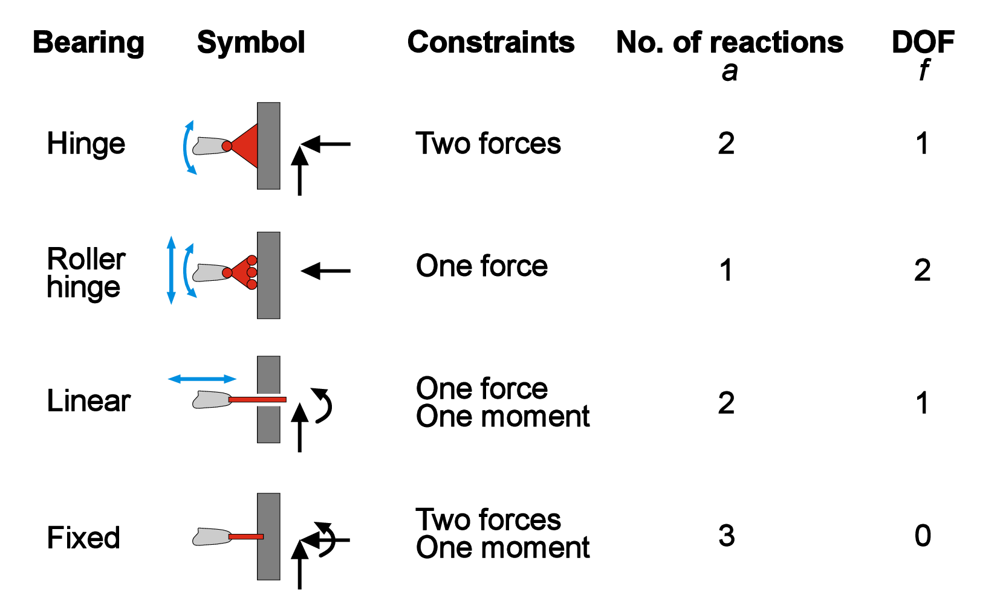
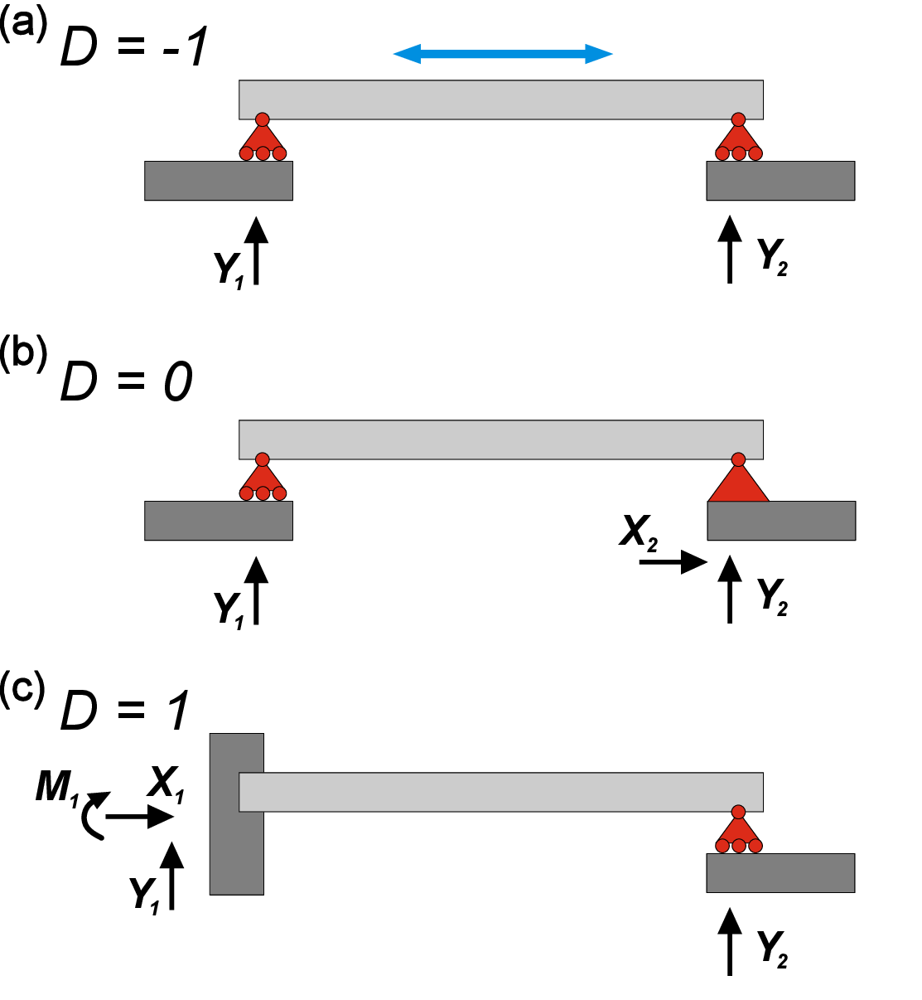
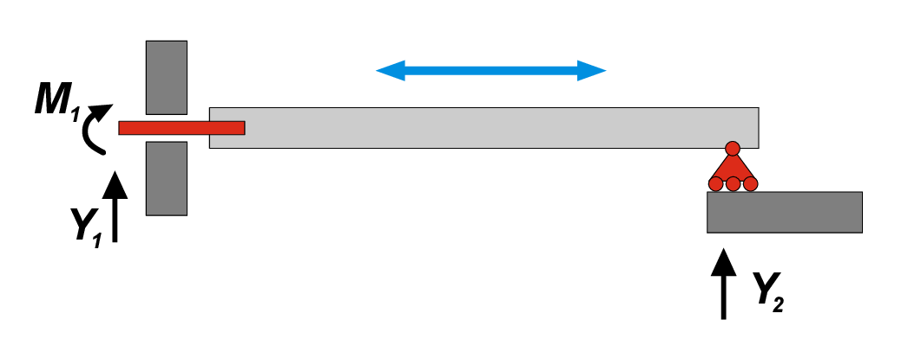
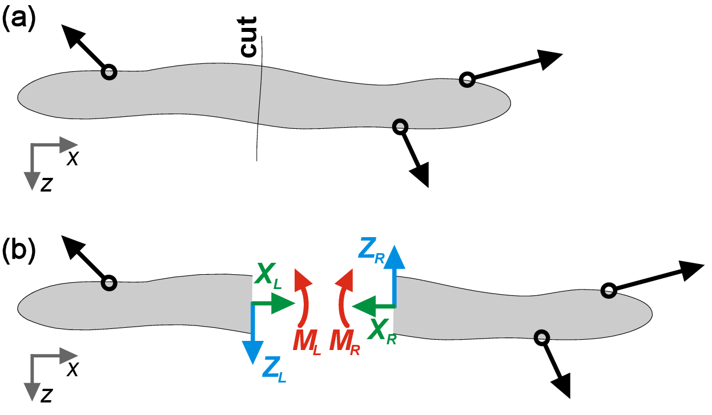
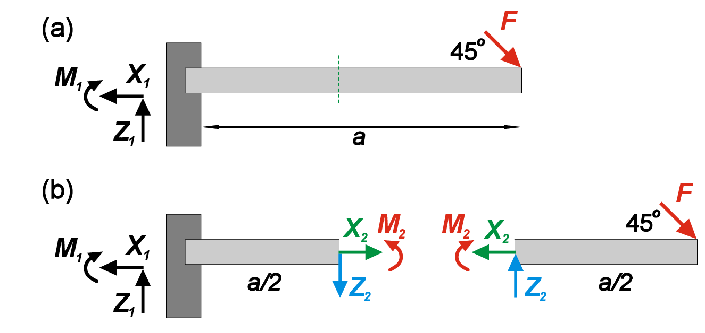

<h2 class='chapterHead'>Chapter 2 Bearings</h2>
<h3 class='sectionHead'>2.1  Bearings and degrees of freedom</h3>
<!-- l. 5 -->
<a class='url' href='https://uni-freiburg.cloud.panopto.eu/Panopto/Pages/Embed.aspx?id=d016adde-d3c6-44e0-8d29-ac720113b2bb'>https://uni-freiburg.cloud.panopto.eu/Panopto/Pages/Embed.aspx?id=d016adde-d3c6-44e0-8d29-ac720113b2bb</a>

<!-- l. 7 -->
 The condition of static equilibrium that we discussed earlier does not mean
that the body is immovable. The body still can translate and rotate; in
a two-dimensional case an object can have three kinematics degrees of
freedom (DoFs): two orthogonal translational displacements along x- and y-
axes, and one rotation around z-axis. The motion of the body can be
restricted by eliminating some DoFs with the help of bearings (Fig. <a href='#x1-2001r1'>2.1<!-- tex4ht:ref: fig:typesofbearings --></a>).
Depending on the type of bearing, one, two, or all three DoFs can be
removed. The kinematic constraints imposed by bearings trigger so-called
bearing reactions, or simply reactions. Note that if exactly all degrees
of freedom are removed, the system is called statically determinate or
isostatic.

<figure class='figure'>

<!-- l. 14 -->
  

<!-- l. 16 -->
figureThe most common types of bearings and corresponding number of
reactions \(a\) and degrees of freedom \(f\).

<figcaption class='caption'>Figure 2.1: The most common types of bearings and corresponding number
of reactions \(a\) and degrees of freedom \(f\). </figcaption><!-- tex4ht:label?: x1-2001r2.1 -->

</figure>
<!-- l. 22 -->
 As you can see, the sum of the number of reactions \(a\) and DoFs \(f\) is
always equal to 3 (for 2D case). This is a necessary (but not a sufficient!)
condition for a statically determinate system with one body. Namely,
\begin {equation} \sum _{i}{a}-3=0 \end {equation}
For more general 2D system with \(n\) connected bodies \begin {equation} \sum _{i}^{n}{a_i}+\sum {z}-3n=0, \end {equation}
where \(z\) is a number of intermediate reaction between movable bodies.

<!-- l. 32 -->
 By knowing a number of bodies \(n\), a number of bearing reactions \(a\) and
intermediate reactions \(z\), we can distinguish three different cases for 2D force
systems defined by the value of \(D\), where \begin {equation} D=\sum _{i}^{n}{a_i}+\sum {z}-3n \label {eq:D} \end {equation}
We know that a determinate (or isostatic) system must have \(D=0\) (Fig. <a href='#x1-2003r2'>2.2<!-- tex4ht:ref: fig:underandoverdefined --></a>b). If \(D&lt;0\),
then the system is movable since it has unrestricted DoF (Fig. <a href='#x1-2003r2'>2.2<!-- tex4ht:ref: fig:underandoverdefined --></a>a). If \(D&gt;0\), then the
system is called indeterminate or hyperstatic - the system is immovable and
contains extra reactions that can be removed (Fig. <a href='#x1-2003r2'>2.2<!-- tex4ht:ref: fig:underandoverdefined --></a>c).

<figure class='figure'>

<!-- l. 44 -->
  

<!-- l. 46 -->
figureMovable (a), determinate (b) and indeterminate (c) force systems.

<figcaption class='caption'>Figure 2.2: Movable (a), determinate (b) and indeterminate (c) force
systems. </figcaption><!-- tex4ht:label?: x1-2003r2.1 -->

</figure>
<!-- l. 50 -->
 Again, we need to emphasize that above-mentioned mathematical
precondition is a necessary, but not sufficient, requirement. One exception from
this rule is the system with two and one reactions in the left and right
bearings respectively shown in Fig. <a href='#x1-2005r3'>2.3<!-- tex4ht:ref: fig:counterexample --></a>. Here, we have \(D=0\), which usually
corresponds to determinate system. However, it is clear that the beam
can move freely in a horizontal direction, therefore it has 1 DoF! In this
specific case, force vectors \(Y_1\) and \(Y_2\) are parallel, and they both can compensate
only vertical direction of action, while the horizontal movement is not
restricted.

<figure class='figure'>

<!-- l. 57 -->
  

<!-- l. 59 -->
figureExample of movable force system with \(D=0\). Parallel vertical forces \(Y_1\) and \(Y_2\)
cannot restrict horizontal movement of the beam.

<figcaption class='caption'>Figure 2.3: Example of movable force system with \(D=0\). Parallel vertical forces \(Y_1\)
and \(Y_2\) cannot restrict horizontal movement of the beam. </figcaption><!-- tex4ht:label?: x1-2005r2.1 -->

</figure>
<h3 class='sectionHead'>2.2  Free body diagrams</h3>
<!-- l. 73 -->
<a class='url' href='https://uni-freiburg.cloud.panopto.eu/Panopto/Pages/Embed.aspx?id=55e9b88e-9101-4af7-8ba5-ac720113b2e3'>https://uni-freiburg.cloud.panopto.eu/Panopto/Pages/Embed.aspx?id=55e9b88e-9101-4af7-8ba5-ac720113b2e3</a>

<!-- l. 75 -->
 Free body diagrams provide a way to compute forces acting inside the body
(internal force variables). By definition, an internal force variable is the resultant
of all internal forces in a solid body at a hypothetical cut through the body
(Fig. <a href='#x1-3001r4'>2.4<!-- tex4ht:ref: fig:freebodydiagram --></a>). If we imagine cutting the body in equilibrium along some line, we
technically create two fragments that are no longer in equilibrium. Therefore we
need to introduce additional forces on the cut to restore the equilibrium and
balance the forces. For a 2D system we can distinguish three resultants on the cut:
longitudinal force \(L\) (perpendicular to cut), transverse/shear force \(Q\) (in plane of cut)
and bending moment \(M\) (perpendicular to the 2D area of force system). Together
with reactions, internal force variables can be determined using a free body
diagram.

<figure class='figure'>

<!-- l. 84 -->
  

<!-- l. 86 -->
figureInternal forces at a hypothetical cut through the body. Note that forces
and moment on left and right sides of the cut compensate each other to
maintain equilibrium.

<figcaption class='caption'>Figure 2.4: Internal forces at a hypothetical cut through the body. Note that
forces and moment on left and right sides of the cut compensate each other
to maintain equilibrium. </figcaption><!-- tex4ht:label?: x1-3001r2.2 -->

</figure>
<!-- l. 91 -->
 By hypothetically splitting the beam into two fragments, we add six internal
force variables on the cut (three for left and three for right) that balance
both fragments. To keep the whole body in equilibrium after ”gluing”
these two fragments back, the internal force variables on the left and
right should have the same amplitude and opposite directions. Therefore,
by cutting the beam, we increase the number of bodies to \(n=2\), however,
we also add three intermediate reactions \(z\), therefore keeping \(D\) constant
(Eq. ??)

<!-- l. 93 -->
Note: To correctly operate with internal force variables, we need to agree on
non-ambiguous sign conventions. We will obey the following rules 

<ul class='itemize1'>
<li class='itemize'>An intersection area is called positive if normal vector is in the
direction of coordinate vector, and negative otherwise;
</li>
<li class='itemize'>Internal force variable (force or moment) is positive if it is located at
a positive intersection area AND if it is in direction with a coordinate
vector;
</li>
<li class='itemize'>The moment is regarded as a vector according to the right-hand rule;
</li>
<li class='itemize'>Note that the reactional internal force variable at the
corresponding negative intersection is also considered as positive.</li></ul>

<figure class='figure'>

<!-- l. 109 -->
  

<!-- l. 111 -->
figureReaction forces and moments in the beam fixed on the left side and
subjected to inclined point load on the right.

<figcaption class='caption'>Figure 2.5: Reaction forces and moments in the beam fixed on the left side
and subjected to inclined point load on the right. </figcaption><!-- tex4ht:label?: x1-3003r2.2 -->

</figure>
<!-- l. 115 -->
 For illustration, we consider an example of a beam with length \(a\), that is fixed
on the left end and subjected to an inclined point load \(F\) on the right end
(Fig. <a href='#x1-3003r5'>2.5<!-- tex4ht:ref: fig:beamexample --></a>). We search for the bearing reactions as well as internal forces in the
middle point of the beam. Simply balancing forces and moments we get
\begin {equation} \begin {aligned} X_1&amp;=F/\sqrt {2} \\ Y_1&amp;=F/\sqrt {2} \\ M_1&amp;=-Fa/\sqrt {2} \end {aligned} \end {equation}
To find the internal forces and moments at the middle of the beam, we need to
cut the beam into two fragments, introduce two reaction forces \(X_2\) and \(Z_2\) and one
reaction moment \(M_2\) to preserve equilibrium. Finally, by balancing the forces for
both fragments we get

<!-- l. 132 -->
 \begin {equation} \begin {aligned} X_2&amp;=F/\sqrt {2} \\ Y_2&amp;=F/\sqrt {2} \\ M_2&amp;=\frac {Fa}{2\sqrt {2}} \end {aligned} \label {eq:middlebeam} \end {equation}

<h2 class='likechapterHead'>Bibliography</h2>

