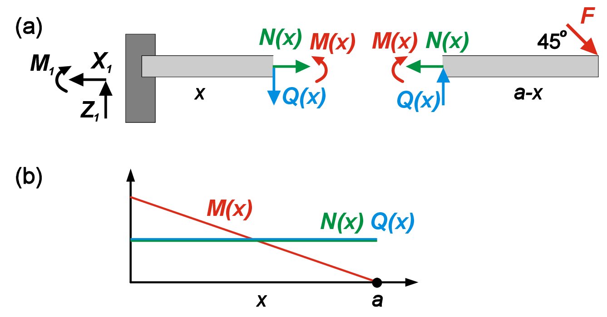
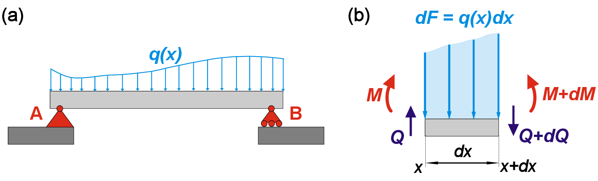

<h2 class='chapterHead'>Chapter 3 Internal forces</h2>
<h3 class='sectionHead'>3.1  Internal force variables</h3>
<!-- l. 5 -->
<a href='https://uni-freiburg.cloud.panopto.eu/Panopto/Pages/Embed.aspx?id=e8a59939-831f-4c0c-bc84-ac720113b31d' class='url'>https://uni-freiburg.cloud.panopto.eu/Panopto/Pages/Embed.aspx?id=e8a59939-831f-4c0c-bc84-ac720113b31d</a>

<!-- l. 7 -->
 In the previous chapter, we considered internal forces appearing on the
hypothetical cuts. Here we continue discussing internal force variables but with a
focus on describing them as a continuous function of the position along the body.
From the previous example (Fig. ??), we know how to find the internal forces in
the middle of the beam (Eq. ??). However, we can also perform the same
procedure for any other section of the beam. Therefore, it makes sense to consider
the reaction forces and moments as functions of the coordinate along the beam
length (Fig. <a href='#x1-2001r1'>3.1<!-- tex4ht:ref: fig:contforce --></a>).

<figure class='figure'>

<!-- l. 14 -->
  

<figcaption class='caption'>Figure 3.1:: (a) Free body diagram for a beam with intermediate cut. (b)
Reaction forces and moments as functions of coordinate \(x\). </figcaption><!-- tex4ht:label?: x1-2001r3.1 -->

</figure>
<!-- l. 20 -->
 Let us consider a cut located at the distance \(x\) from the left hinge/wall
(Fig. <a href='#x1-2001r1'>3.1<!-- tex4ht:ref: fig:contforce --></a>). By balancing forces and moments acting on the left and right
fragments, it is easy to show that

<!-- l. 29 -->
 \begin{equation} \begin{aligned} N(x)&amp;=F/\sqrt{2} \\ Q(x)&amp;=F/\sqrt{2} \\ M(x)&amp;=\frac{F(a-x)}{\sqrt{2}} \end{aligned} \label{eq:continuousbeam} \end{equation}

<!-- l. 31 -->
 Therefore, both longitudinal and shear forces are constant functions
of the coordinate \(x\), while moment linearly decreases with an increase in
\(x\).

<h3 class='sectionHead'>3.2  Distributed loads</h3>
<!-- l. 35 -->
<a href='https://uni-freiburg.cloud.panopto.eu/Panopto/Pages/Embed.aspx?id=716dd142-5797-4567-a3e1-ac720113b35a' class='url'>https://uni-freiburg.cloud.panopto.eu/Panopto/Pages/Embed.aspx?id=716dd142-5797-4567-a3e1-ac720113b35a</a>

<!-- l. 37 -->
 Prior to this moment, we have considered only idealized point forces. Now we
will consider loads distributed along the region of the body (line loads). We will
learn how to search for internal forces without exact knowledge of the reaction
forces and move towards governing equation of continuum mechanics in the next
Chapter.

<!-- l. 39 -->
Note: In our next derivations, we will heavily rely on a very useful mathematical
concept of Taylor expansion of the function. If we have arbitrary function \(f(x)\), then
we can try to approximate it in the vicinity of point \(x_0\) using a polynomial function.
So we can find the approximate value of \(f(x+\Delta x)\) just knowing the properties of the
function in the point \(x_0\). We will skip the strict mathematical discussion of the
necessary conditions and restrictions on function \(f\) and value of \(\Delta x\), and just claim
that for a small enough \(\Delta x\) and well-behaved function \(f\), the Taylor expansion
provides a good approximation of \(f\). For example, the second order approximation
of \(f(x+\Delta x)\) can be expressed as \begin{equation} f(x_0+\Delta x)=f(x_0)+\Delta x f'(x_0)+ \frac{1}{2}\Delta x^2 f''(x_0)+O(\Delta x^3) \end{equation}
In shorter form the general Taylor expansion can be written as \begin{equation} f(x_0+\Delta x)=\sum _{i=0}^{\infty }\frac{1}{n!}f^{(i)}(x_0)\Delta x^i \end{equation}
Note, that \(f^{(i)}\) means \(i-\)th derivative of the function, while \(\Delta x^i\) is a regular power. 

<figure class='figure'>

<!-- l. 57 -->
  

<figcaption class='caption'>Figure 3.2:: (a) A beam subjected to distributed load. (b) Infinitesimal
fragment of beam and corresponding forces. </figcaption><!-- tex4ht:label?: x1-3001r3.2 -->

</figure>
<!-- l. 63 -->
 Let us consider a straight beam subjected to line load that can be expressed as
a function of the coordinate \(q(x)\) (Fig. <a href='#x1-3001r2'>3.2<!-- tex4ht:ref: fig:distrload --></a>). We select a very small (infinitesimal)
beam element of length \(dx\) stretching from coordinate \(x\) to \(x+dx\). Note that here we use \(dx\)
instead of \(\Delta x\) to emphasize the infinitesimal length of this piece. Due to that \(dx&lt;&lt;(dx)^2\), and
we can use the first order Taylor expansion to find the change in total applied
force between left and right ends of the selected beam as \(dF=q(x)dx\). Let us now write
equilibrium equation for the small piece, taking into account that we can
express the shear force and moment on the right side as \(Q(x+dx)=Q+dQ\) and \(M(x+dx)=M+dM\) respectively.
\begin{equation} Q(x)+dQ=Q(x)-q(x)dx \end{equation}
We also can write Taylor expansion of \(Q(x)\) at \(x\) as \begin{equation} Q(x)+dQ=Q(x)+\frac{dQ}{dx}dx+... \end{equation}
By comparing coefficients in these two equations, we conclude that \begin{equation} q(x)=-\frac{dQ}{dx} \end{equation}
This equation establishes the relation between line load and internal shear force in
the body. To balance moments, we write \begin{equation} M(x)+dM=M(x)+Q(x)dx \end{equation}
Similar to force, we can obtain the first order Taylor expansion and get \begin{equation} q(x)=-\frac{d^2M}{dx^2} \end{equation}

<!-- l. 84 -->
 Therefore, we can express \(Q(x)\) and \(M(x)\) via integration as \begin{equation} \begin{aligned} Q(x)&amp;=-\int{q(x)dx}+C_1 \\ M(x)&amp;=\int{Q(x)dx}+C_2 \end{aligned} \label{eq:integrationmoment} \end{equation}
Integration constants \(C_1\) and \(C_2\) have to be found from boundary conditions at
bearings and intermediate conditions at connections between body parts.
Boundary conditions depend on the bearing type. For example, simple hinge
implies \(M=0\), and free end provides two boundary conditions \(M=0\) and \(Q=0\) simultaneously.
Note that by computing shear force and moment via integration (Eq. ??), we do
not need to calculate bearing reactions at all. If we recall Fig. ?? describing the
different types of hinges, we can notice that each degree of freedom corresponds to
additional equality boundary conditions that can be used to find integration
constants (Eq. ??).

<h2 class='likechapterHead'>Bibliography</h2>

