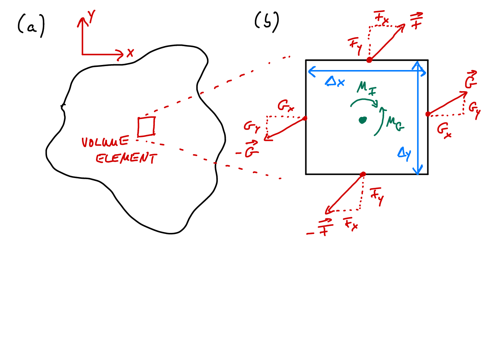

<h2 class='chapterHead'>Chapter 4 Elastostatic equilibrium</h2>

<!-- l. 3 -->
Note: We will make extensive use of vector and tensor calculus in this and the
following chapters, and it is important to clearly lay out the mathematical
notation used here.

<!-- l. 6 -->
 Given a function \(f(x,y)\), we write the partial derivative of this function with respect
to \(x\) as \begin{equation} \frac{\partial f}{\partial x} = \partial _x f = f_{,x}. \end{equation}
All variables following a comma in a subscript are derivatives. The second
derivative with respect to \(x\) is then \begin{equation} \frac{\partial ^2 f}{\partial x^2} = \partial ^2_x f = f_{,xx}. \end{equation}
Mixed derivatives are written as \begin{equation} \frac{\partial ^2 f}{\partial x \partial y} = \partial _x\partial _y f = f_{,xy}. \end{equation}
The total derivative is indicated with the letter \(\dif \), e.g. \begin{equation} \label{eq:totalderiv} \frac{\dif f}{\dif t} = \frac{\partial f}{\partial x} \frac{\partial x}{\partial t} + \frac{\partial f}{\partial y} \frac{\partial y}{\partial t} =f_{,x}x_{,t}+f_{,y}y_{,t} \end{equation}
for \(f=f(x,y)\), \(x=x(t)\) and \(y=y(t)\).

<!-- l. 26 -->
 Sometimes the prime is used to indicate a derivative, e.g. \(f'(x)=\dif f/\dif x\) is the derivative of \(f\).
It is also common to indicate the derivative with respect to time by a dot, i.e.
given \(f(t)\) the derivative \(\dot{f}(t)=\dif f/\dif t\). Higher order derivatives are sometime indicated by the
order in parentheses, e.g. \(f^{(n)}(x)=\dif ^n f/\dif x^n\) – for \(n=2\) giving \(f^{\prime \prime }(x)=f^{(2)}(x)=\dif ^2 f/\dif x^2\). We will use these notations occasionally
for brevity but point out that writing the differential operator explicitly is less
ambiguous. In particular, for functions of more than one variable the
differential operator allows us to distinguish clearly between total and partial
derivatives.

<!-- l. 28 -->
 We will also make use of Einstein summation. Einstein summation is an
implicit summation over repeated indices (i.e. a summation where the
\(\sum \)-sign is omitted). As a simple example, consider the total derivative of a
function \(f(\vec{r})\) with \(\vec{r}=(x,y)\) equivalent to Eq. \eqref{eq:totalderiv}. We can write this as
\begin{equation} \frac{\dif f}{\dif t} = f_{,x}r_{x,t}+f_{,y}r_{y,t} = \sum _{i=x,y} f_{,i} r_{i,t} = f_{,i} r_{i,t} \end{equation}
where in the right hand side the sum is implicit because the index \(i\) is repeated.
We will come back to this notation when discussing explicit examples
below.

<!-- l. 40 -->
 We use explicit arrows, \(\v{v}\) to indicate first-order tensors (vectors) and underline
second-order tensors (matrices), \(\t{M}\). A fourth-order tensor is underlined twice, \(\tt{C}\). Unit
vectors (vector of length one) are denoted by a hat, \(\hat{n}\). Note that we chose
this notation over using, e.g., bold font to indicate vectors because it is
blackboard friendly. It can be used on blackboards and typeset notes alike. 

<h3 class='sectionHead'>4.1  Stress and static equilibrium</h3>
<!-- l. 47 -->
<a class='url' href='https://uni-freiburg.cloud.panopto.eu/Panopto/Pages/Embed.aspx?id=c3d56bf8-3178-43ac-8c58-ac720115ef26'>https://uni-freiburg.cloud.panopto.eu/Panopto/Pages/Embed.aspx?id=c3d56bf8-3178-43ac-8c58-ac720115ef26</a>

<!-- l. 49 -->
 We will treat elasticity exclusively in the limit of small or infinitesimal strains

where all equations are linear. The generalization of this “small strain”
theory is “finite strain” elasticity which we will not treat in this class. Note
that linear elasticity is a classical field theory, this means all quantities
typically depend continuously on positions \(\v{r}\). Those quantities are called
fields.

<!-- l. 51 -->
 The central quantities of small strain elasticity are the (Cauchy) stress field \(\t{\sigma }(\v{r})\)
and the displacement field \(\v{u}(\v{r})\). Given a material point has moved from position \(\v{r}\) to \(\v{r}^\prime \),
the displacement field is \(\v{u}(\v{r})=\v{r}^\prime -\v{r}\). It therefore describes by how much a volume element in
our deformed material has moved (or displaced) because of the deformation. The
stress \(\t{\sigma }\) is a tensor that transforms an area (vector) \(\v{A}\) into a force vector \(\v{F}\),
\begin{equation} \v{F}=\t{\sigma }\cdot \v{A} \label{eq:stressarea} \end{equation}
Note that the area here is a vectorial quantity; the direction of this area vector
points outwards on that area, i.e. \(\v{A}=A \hat{n}\) where \(\hat{n}\) is the normal vector on the respective
area.

<!-- l. 57 -->
 In three-dimensions, the stress tensor is represented by a \(3\times 3\) matrix. A tensor
describes a linear relationship between two quantities; the stress tensor describes
the relationship between area of a virtual plane in our solid and the force acting
on it, Eq. \eqref{eq:stressarea}. The fact that both force and normal
vector of the area are represented in a certain coordinate system implies
certain properties of the tensors, in particular for the transformation of
the elements of the tensor under rotation of this coordinate system. We
will discuss those in detail in the next chapter. For the remainder of this
chapter, we only need property Eq. \eqref{eq:stressarea} of the stress
tensor.

<!-- l. 59 -->

<h3 class='sectionHead'>4.2  Force equilibrium</h3>
<!-- l. 61 -->
We will now consider the equilibrium of forces inside a solid body. Specifically, we
regard a small volume element inside this body. Figure <a href='#x1-3001r1'>4.1<!-- tex4ht:ref: fig:force_equilibrium --></a>a shows a sketch of
some body with a volume element highlighted in red. If side lengths of the
element \(\Delta x\), \(\Delta y\) and \(\Delta z\) are small enough, then the forces on opposite sites of the element
must balance. We here denote the forces on the faces perpendicular to the
\(x\)-direction by \(\v{X}\), the forces on the \(y\)-faces by \(\v{Y}\) and the forces on the \(z\)-faces by \(\v{Z}\) (see
Fig. <a href='#x1-3001r1'>4.1<!-- tex4ht:ref: fig:force_equilibrium --></a>b, \(z\)-direction not shown). If we know the areas, we can get the forces from
the stress tensor \(\t{\sigma }\) (that converts areas into forces, see Eq. \eqref{eq:stressarea}),
specifically \begin{align} \label{eq:forceX} \v{X} &amp;= \begin{pmatrix} \sigma _{xx} \Delta y \Delta z \\ \sigma _{yx} \Delta y \Delta z \\ \sigma _{zx} \Delta y \Delta z \\ \end{pmatrix} \\ \label{eq:forceY} \v{Y} &amp;= \begin{pmatrix} \sigma _{xy} \Delta x \Delta z \\ \sigma _{yy} \Delta x \Delta z \\ \sigma _{zy} \Delta x \Delta z \\ \end{pmatrix} \\ \label{eq:forceZ} \v{Z} &amp;= \begin{pmatrix} \sigma _{xz} \Delta x \Delta y \\ \sigma _{yz} \Delta x \Delta y \\ \sigma _{zz} \Delta x \Delta y \\ \end{pmatrix}. \end{align}

<!-- l. 91 -->
 Note that \(\v{X}\), \(\v{Y}\), \(\v{Z}\) and \(\t{\sigma }\) are fields; they explicitly depend on position \(\v{r}\) within the

body.

<figure class='figure'>

<!-- l. 97 -->
  

<figcaption class='caption'>Figure 4.1:: Force equilibrium in a small volume element inside a solid body.
</figcaption><!-- tex4ht:label?: x1-3001r4.2 -->

</figure>
<!-- l. 103 -->
 For a volume element located at position \(\v{r}=(x,y,z)\), force equilibrium inside the element
can be expressed as \begin{equation} \label{eq:forceeq} \begin{split} \v{X}(x+\Delta x, y, z) - \v{X}(x, y, z) &amp;+ \v{Y}(x, y+\Delta y, z) - \v{Y}(x, y, z) \\ &amp;+ \v{Z}(x, y, z+\Delta z) - \v{Z}(x, y, z) = \v{F}(x,y,z) \end{split} \end{equation}
where \(\v{F}(x,y,z)\) is an external force, often called the body force, acting on the volume
element. We can insert Eqs. \eqref{eq:forceX}, \eqref{eq:forceY} and
\eqref{eq:forceZ} and divide by the volume of the element \(\Delta x \Delta y \Delta z\) to obtain
\begin{equation} \begin{split} \frac{\sigma _{xx}(x+\Delta x,y,z)-\sigma _{xx}(x, y, z)}{\Delta x} &amp;+ \frac{\sigma _{xy}(x,y+\Delta y,z)-\sigma _{xy}(x, y, z)}{\Delta y} \\ &amp;+\frac{\sigma _{xz}(x,y,z+\Delta z)-\sigma _{xz}(x, y, z)}{\Delta z} = f_x(x,y,z) \end{split} \end{equation}
for the \(x\)-component of Eq. \eqref{eq:forceeq}. Here \(f_x=F_x/\Delta x \Delta y \Delta z\) is a volume force. In the limit
\(\Delta x\to 0\) and \(\Delta y\to 0\) this becomes \begin{equation} \frac{\partial \sigma _{xx}}{\partial x} + \frac{\partial \sigma _{xy}}{\partial y} + \frac{\partial \sigma _{xz}}{\partial z} = f_x. \end{equation}
From the \(y\) and \(z\)-component of Eq. \eqref{eq:forceeq} we get two more differential
equations, \begin{align} \frac{\partial \sigma _{yx}}{\partial x} + \frac{\partial \sigma _{yy}}{\partial y} + \frac{\partial \sigma _{yz}}{\partial z} &amp;= f_y \\ \frac{\partial \sigma _{zx}}{\partial x} + \frac{\partial \sigma _{zy}}{\partial y} + \frac{\partial \sigma _{zz}}{\partial z} &amp;= f_z. \end{align}

<!-- l. 155 -->
 These can be summarized to the compact notation \begin{equation} \label{eq:equilibriumcondition} \nabla \cdot \t{\sigma } \equiv \text{div}\, \t{\sigma } = \v{f}, \end{equation}
or in word: The divergence of the stress tensor equals the body force.
Equation \eqref{eq:equilibriumcondition} is the central expression of elastostatics
that describes force balance within a solid body.

<!-- l. 163 -->
Note: The differential operators in tensor calculus are defined by means of the
nabla operator \(\nabla \). In an \(n\)-dimensional Euclidean space equipped with Cartesian
coordinates it reads \begin{equation} \label{eq:nablanDCart} \nabla =\left (\frac{\partial }{\partial x_1},\frac{\partial }{\partial x_2},\dots ,\frac{\partial }{\partial x_n} \right )=\sum _{i=1}^{n}\hat{e}_i\frac{\partial }{\partial x_i}, \end{equation}
where \(\hat{e}_i\) is the unit vector pointing in the \(i\)-th cartesian direction. 

<!-- l. 171 -->
 An alternative derivation of force balance invokes the divergence theorem. We
can integrate Eq. \eqref{eq:equilibriumcondition} over a volume element inside
this body of volume \(V\) and surface area \(S(V)\). Using the divergence theorem (sometimes
also called Gauss’ theorem), we obtain \begin{equation} \label{eq:sumofforcesinV} \int _V \dif ^3 r\, \nabla \cdot \t{\sigma } = \int _{S(V)} \dif ^2 r\,\t{\sigma } \cdot \v{e}_S = \int _{S(V)} \dif ^2 r\,\dif \v{F} = \int _V \dif ^3 r\,\v{f} \end{equation}
where \(\v{e}_S\) is the normal vector pointing outwards on \(S(V)\). The infinitesimal area vector \(\v{e}_S \dif ^2 r\)
is hence transformed into an (infinitesimal) force vector \(\dif \v{F} = \t{\sigma } \cdot \v{e}_S \dif ^2 r\) and integrated over.
Eq. \eqref{eq:sumofforcesinV} hence contains a sum over all forces acting on the
surface of the volume element \(V\), and these forces must sum to the body force. It is
nothing else than a statement of force balance for any volume element within the
solid body.

<!-- l. 179 -->
Note: The divergence theorem is an important result of vector analysis. It
converts an integral over a volume \(V\) into an integral over the surface \(S\)
of this volume. For a vector field \(\v{f}(\v{r})\), the divergence theorem states that
\begin{equation} \int _V \dif ^3 r\, \nabla \cdot \v{f}(\v{r}) = \int _{S} \dif ^2 r\, \v{f}(\v{r}) \cdot \hat{n}(\v{r}) \label{eq:divergencetheorem} \end{equation}
Here, \(\hat{n}(\v{r})\) is the normal vector pointing outward on the surface \(S\) of the volume \(V\). 

<!-- l. 190 -->
Note: Note that \(\nabla \cdot \t{\sigma } \equiv \text{div} \ \t{\sigma }\). Sometimes it is useful to make use of Einstein summation, i.e.
implicit summation over repeated indices within the same quantity of in products.
Examples are: \(\nabla \cdot \t{\sigma } = \partial _{i} \sigma _{ij} = \sum _i \partial _{i} \sigma _{ij}, 3\,\sigma _h = \sigma _{kk} = \sum _k \sigma _{kk} = tr \,\t{\sigma }\), where \(\sigma _h\) is the hydrostatic stress. In the solid mechanics literature,
derivatives are often expressed as indices following a comma. For example, the
derivative of the function \(f(x,y,z)\) with respect to \(x\) would be written as \(f_{,x}\). In this notation,
Eq. \eqref{eq:equilibriumcondition} becomes \(\nabla \cdot \t{\sigma } = \partial _{i} \sigma _{ij} = \sigma _{ij,i}=0\). By virtue of the Einstein
summation convention we need to sum over the repeated index \(i\) in the
right hand side expression. Vector/tensor and component notation with
Einstein summation will be used intermixed throughout these notes. 

<h3 class='sectionHead'>4.3  Moment equilibrium</h3>
<!-- l. 196 -->
Besides equilibrium of forces, we also need to fulfill the equilibrium of moments
acting on the volume element. The moment around the \(z\)-axis is given by
\begin{equation} Y_x \Delta y + X_y \Delta x = 0 \end{equation}
which immediately implies \(\sigma _{yx}=\sigma _{xy}\). The moment equilibrium around the \(x\)- and \(y\)-axes
leads to conditions on the other off-diagonal components of \(\t{\sigma }\), \(\sigma _{zx}=\sigma _{xz}\) and \(\sigma _{zy}=\sigma _{yz}\). By
virtue of moment balance, the stress tensor is a symmetric tensor, \(\sigma _{ij}=\sigma _{ji}\) or
\(\t{\sigma }=\t{\sigma }^T\).

<h2 class='likechapterHead'>Bibliography</h2>

